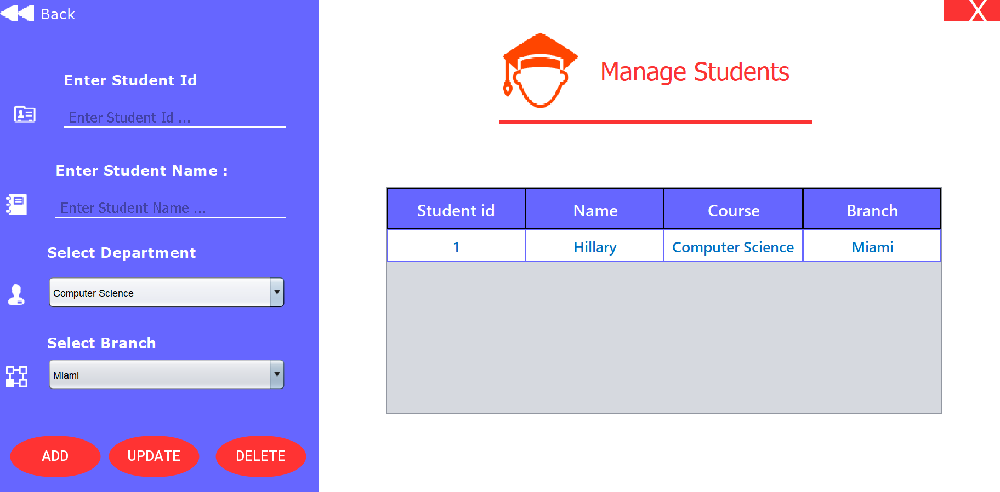

# Library-Management-System
Library Management System (Java)
Description
The Library Management System is a comprehensive software solution built using Java to streamline and automate the operations of a library. This system provides librarians and patrons with a user-friendly interface for managing library resources, including books, journals, DVDs, and more.

Key features of the Library Management System include:

Catalog Management: Easily add, edit, and delete library items, including details such as title, author, publication date, and genre.
Borrowing and Returning: Simplify the borrowing process for patrons and track the status of borrowed items, including due dates and overdue fines.
User Management: Maintain records of library members, including registration details, borrowing history, and account status.
Search and Discovery: Enable patrons to search for library items based on various criteria, such as title, author, or keyword, and view availability status.
Reporting and Analytics: Generate reports on library usage, circulation statistics, popular items, and overdue materials to inform decision-making and optimize operations.
Administrative Tools: Empower librarians with administrative capabilities to manage system settings, permissions, and configurations.
Whether it's a public library, academic institution, or corporate resource center, the Library Management System provides a robust platform for efficiently managing library collections and enhancing user experience, all implemented in Java for reliability and scalability.

Installation
To deploy the Library Management System, follow the installation instructions provided in the project repository on GitHub. This may involve setting up a server environment, configuring the database, and deploying the Java application.

Usage
Access the Library Management System through a web browser or dedicated client application.
Log in with appropriate credentials (admin, librarian, or patron).
Navigate through the system's modules to perform desired tasks, such as adding new items, checking out books, or generating reports.
Follow on-screen prompts and instructions to complete actions and transactions within the Java-based system.
Contributing
Contributions to the Library Management System project are welcome! Whether it's bug fixes, feature enhancements, or documentation improvements, please feel free to contribute by submitting pull requests on GitHub.

License
This project is licensed under the MIT License - see the LICENSE file for details.

Images to project

